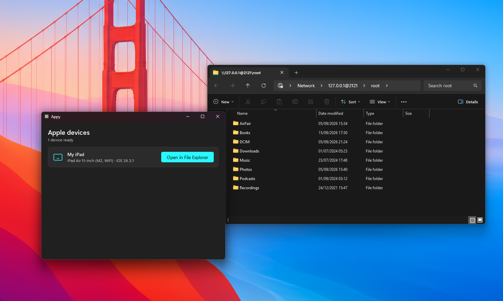

<p align="center">
  
</p>

<h1 align="center">Hudzen</h1>

<p align="center">Viewing and copying your iPhone files is <strong>BROKEN</strong>. Hudzen fixes it!!!</p>

<p align="center">Browse your iPhone or iPad in Windows File Explorer, over USB, at full speed.</p>

<p align="center">
  <a href="https://github.com/jaym-01/Hudzen/releases/latest"><b>Download</b></a> ·
  <a href="docs/usage.md"><b>Docs</b></a> ·
  <a href="docs/how-it-works.md"><b>How it works</b></a>
</p>

<p align="center">
  
</p>

## Why

Explorer talks to iPhones over MTP, which is slow and hides the real
filesystem. Hudzen uses AFC, the protocol iTunes uses and serves it to
Explorer as a local, read-only share.

## Install

1. Install the [Apple Devices](https://apps.microsoft.com/detail/9np83lwlpz9k)
   app from the Microsoft Store (or iTunes). It supplies the USB driver.
2. Download `HudzenSetup.exe` from the
   [latest release](https://github.com/jaym-01/Hudzen/releases/latest) and run
   it. Per-user, no admin prompt.

Or from source, with Python 3.11+:

```bash
pip install -r requirements.txt
python run.py
```

## Use

1. Plug in your iPhone or iPad, unlock it, and tap **Trust**.
2. Open Hudzen and press **Open in File Explorer**.
3. Copy files off the device like you would from any folder.

Hudzen is read-only: nothing can be written to or deleted from the device.
The server only listens on `127.0.0.1` and stops when Hudzen closes.

## Docs

- [Usage](docs/usage.md)
- [How it works](docs/how-it-works.md)
- [Development](docs/development.md) and [building](docs/building.md)
- [Privacy policy](docs/privacy.md)

## License

[GPL-3.0](LICENSE).
